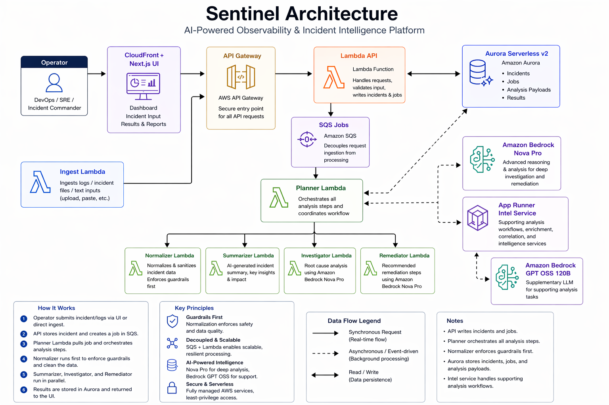
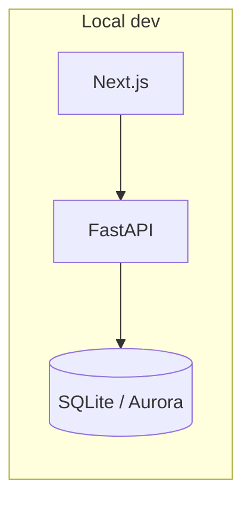

# Sentinel

**Production:** [https://d2ffskcz761exz.cloudfront.net/](https://d2ffskcz761exz.cloudfront.net/)

**Sentinel** is an AI-powered incident intelligence platform. It turns raw logs and incident narratives into structured analysis—summaries, severity, likely root cause, evidence-grounded remediation, and exportable reports—so teams can respond faster with less manual triage.

<p align="center">
  <a href="https://www.python.org/"></a>
  <a href="https://fastapi.tiangolo.com/"></a>
  <a href="https://docs.pydantic.dev/"></a>
  <a href="https://docs.astral.sh/uv/"></a>
  <a href="https://pytest.org/"></a>
  <a href="https://nextjs.org/"></a>
  <a href="https://react.dev/"></a>
  <a href="https://nodejs.org/"></a>
  <a href="https://clerk.com/"></a>
  <a href="https://www.terraform.io/"></a>
  <a href="https://aws.amazon.com/"></a>
  <a href="https://mermaid.js.org/"></a>
  <a href="https://recharts.org/"></a>
</p>

## Architecture

### Architecture overview

Sentinel uses an **event-driven, serverless** layout on AWS. Operators use the **CloudFront-hosted Next.js** dashboard; traffic goes through **API Gateway** to the **Lambda API**, which persists **incidents, jobs, and analysis** in **Aurora Serverless** and enqueues work on **SQS**. The **Planner Lambda** runs the pipeline (**normalizer → summarizer → investigator → remediator**). **Amazon Bedrock** powers the heavy reasoning steps, and the **App Runner Intel service** adds supporting analysis. Results are stored and surfaced back in the dashboard for visualization and reporting.

### Diagram



### Local development

For day-to-day work, the UI and API run on your machine; the database is typically SQLite unless you point the app at Aurora.



Deeper reference: [guides/architecture.md](guides/architecture.md), [guides/agent_architecture.md](guides/agent_architecture.md), and [intel.md](intel.md).

**Agent roles** (see [AGENTS.md](AGENTS.md)):

| Module | Role |
|--------|------|
| **Planner** | Orchestrates the incident analysis flow |
| **Normalizer** | Cleans input, guardrails, evidence snippets |
| **Summarizer** | Short narrative + severity |
| **Investigator** | Root-cause analysis (strong model; Nova Pro in AWS guidance) |
| **Remediator** | Remediation plan and next steps (strong model) |

---

## Table of contents

- [Architecture](#architecture)
- [Why Sentinel](#why-sentinel)
- [What you get](#what-you-get)
- [Repository layout](#repository-layout)
- [Prerequisites](#prerequisites)
- [Quick start](#quick-start)
- [Configuration](#configuration)
- [Running locally](#running-locally)
- [API overview](#api-overview)
- [Frontend](#frontend)
- [Tests](#tests)
- [AWS deployment](#aws-deployment)
- [Documentation](#documentation)
- [Squad contributions](#squad-contributions)
- [Tech stack](#tech-stack)

---

## Why Sentinel

Production incidents rarely arrive as clean stories. Operators paste logs, paste Slack threads, and work under time pressure. Sentinel runs a **modular agent pipeline** (normalize → summarize → investigate → remediate) with **guardrails** (prompt-injection handling, evidence extraction, confidence-aware behavior) and surfaces results in a **Next.js dashboard** backed by a **FastAPI** service.

---

## What you get

- **Incident analysis**: Automated summary, severity, root-cause hypotheses, and prioritized remediation actions.
- **Operational UI**: Submit incidents, review jobs, charts, and deep-dive reports ([frontend](#frontend)).
- **Real-time feedback**: Server-Sent Events for pipeline stages and investigation streaming (see [API overview](#api-overview)).
- **Remediation workflow**: Track actions, per-action chat for guidance, follow-ups, and clarification Q&A.
- **Reporting**: JSON/PDF exports, audit PDFs, periodic digests, post-incident review (PIR) helpers.
- **Integrations & webhooks**: Alertmanager / CloudWatch-style ingestion hooks, optional email reminders (Resend).
- **Auth**: [Clerk](https://clerk.com/) for production-style sign-in; local bypass when Clerk is not configured.

---

## Repository layout

| Path | Purpose |
|------|---------|
| [backend/](backend/) | FastAPI app, agents, pipeline, store, reports, scheduler, ingest |
| [frontend/](frontend/) | Next.js 14 (Pages Router) dashboard |
| [terraform/](terraform/) | Stage-based AWS IaC (see guides 1–8) |
| [scripts/](scripts/) | Local orchestration (`run_local.py`), utilities |
| [guides/](guides/) | Permissions, SageMaker, ingestion, DB, agents, frontend, enterprise |
| [intel.md](intel.md) | Deep-dive: files, APIs, frontend, infra |
| [gameplan.md](gameplan.md) | Delivery sequence and guardrail strategy |

---

## Prerequisites

- **Python** ≥ 3.12
- **[uv](https://docs.astral.sh/uv/)** for installing and running Python tools
- **Node.js** and **npm** (for the frontend)

---

## Quick start

1. **Clone** the repository and enter the project root.

2. **Environment file**

   ```bash
   cp .env.example .env
   ```

   Edit `.env` so **exactly one** of `USE_OPEN_ROUTER` or `USE_BEDROCK` is `true` for LLM calls (see [Configuration](#configuration)).

3. **Install frontend dependencies** (first run only)

   ```bash
   cd frontend && npm install && cd ..
   ```

4. **Start backend + frontend** (recommended)

   ```bash
   cd scripts && uv run run_local.py
   ```

   - Backend: [http://localhost:8000](http://localhost:8000)
   - Frontend: [http://localhost:3000](http://localhost:3000)

   If Clerk JWKS / issuer URLs are **not** set, the orchestrator sets `AUTH_DISABLED=true` so you can develop without signing in.

---

## Configuration

Copy [.env.example](.env.example) to `.env` at the repo root. Important groups:

### LLM provider (pick one)

| Mode | When to use | Key variables |
|------|-------------|----------------|
| **OpenRouter** | Easiest for local development | `USE_OPEN_ROUTER=true`, `USE_BEDROCK=false`, `OPENROUTER_API_KEY`, optional `OPENROUTER_MODEL` (default `openai/gpt-4o-mini`) |
| **AWS Bedrock** | Production / AWS-aligned setup | `USE_BEDROCK=true`, `USE_OPEN_ROUTER=false`, AWS credentials, `BEDROCK_MODEL_ID`, region |

### Authentication (Clerk)

- `NEXT_PUBLIC_CLERK_PUBLISHABLE_KEY`, `CLERK_SECRET_KEY`, `CLERK_JWKS_URL` or `CLERK_ISSUER` (as used by the backend) enable full auth.
- Omitting Clerk config triggers **auth disabled** mode when using `scripts/run_local.py`, as described above.

### Notifications (Resend)

- `RESEND_API_KEY`, `RESEND_FROM` for follow-up emails (test sender supported).

### Optional AWS

- `S3_BUCKET` for uploads / PDF flows that use S3.
- `DEFAULT_AWS_REGION`, account and access keys as needed for Bedrock or S3.

For narrative setup instructions, see the **Local Development** section in [intel.md](intel.md).

---

## Running locally

### Both services

```bash
cd scripts
uv run run_local.py
```

### Backend only

```bash
cd backend
uv run uvicorn api.main:app --host 0.0.0.0 --port 8000
```

### Frontend only

```bash
cd frontend
npm install
npm run dev
```

**Health check**: `GET http://localhost:8000/health`

---

## API overview

Base URL in local development: `http://localhost:8000`

| Area | Examples |
|------|----------|
| **Core** | `GET /health`, `GET /api/me`, `GET /api/team/members` |
| **Incidents & jobs** | `POST /api/incidents`, `POST /api/incidents/analyze-sync`, `GET /api/jobs`, `GET /api/jobs/{job_id}`, `POST /api/jobs/{job_id}/run`, `GET /api/jobs/{job_id}/workflow` |
| **Streaming** | `GET /api/jobs/{job_id}/stream`, `POST /api/stream/investigate` |
| **Exports** | `GET /api/jobs/{job_id}/export`, `GET /api/jobs/{job_id}/audit/pdf` |
| **Remediation** | `GET/PATCH .../actions`, chat `GET/POST .../actions/{action_id}/chat`, `POST .../actions/{action_id}/evaluate` |
| **Follow-ups & clarify** | follow-ups under `/api/jobs/{job_id}/follow-ups`, clarifications under `/api/jobs/{job_id}/clarify` |
| **Integrations** | `GET/POST /api/integrations`, webhooks under `/api/ingest/webhook*` |
| **Analytics & reports** | `GET /api/analytics/mttr`, `POST /api/reports/digest`, PIR routes under `/api/jobs/{job_id}/pir` |

Interactive docs: when the API is running, OpenAPI is available at `/docs` (Swagger UI) unless disabled in your build.

---

## Frontend

Next.js **Pages Router** app (`frontend/pages/`):

| Route | Purpose |
|-------|---------|
| `/` | Analyze: submit incident text |
| `/dashboard` | Jobs, stats, analysis detail |
| `/audit` | Audit-oriented views |
| `/settings` | Integrations and preferences |
| `/sign-in`, `/sign-up` | Clerk auth |

The UI calls the API at **`NEXT_PUBLIC_API_URL`** when set; otherwise it defaults to `http://localhost:8000` (see [frontend/lib/api.js](frontend/lib/api.js)). With `run_local.py`, you can put `NEXT_PUBLIC_*` and Clerk keys in the **root** `.env`. If you run `npm run dev` alone, you can instead use **`frontend/.env.local`** (see [frontend/README.md](frontend/README.md)).

---

## Tests

Backend tests use **pytest**. From the repo root:

```bash
cd backend
uv run pytest
```

There are also package-level tests under services such as `backend/ingest/` and `backend/database/`; running `pytest` from `backend/` discovers the main suite. For ingestion verification specifically, see [backend/ingest/test_ingest.py](backend/ingest/test_ingest.py) and [guides/3_ingestion.md](guides/3_ingestion.md).

Beyond automated suites, **end-to-end validation** means exercising realistic operator workflows against a running stack (for example, submitting an incident, waiting for job completion, and confirming analysis and exports in the UI), complementing faster pytest coverage.

---

## AWS deployment

Infrastructure is organized as **independent Terraform stages** under [terraform/](terraform/), aligned with [guides/1_permissions.md](guides/1_permissions.md) through [guides/8_enterprise.md](guides/8_enterprise.md). Use each stage’s `terraform.tfvars.example` (where present) as a template.

**Suggested order** is documented in [gameplan.md](gameplan.md): permissions → SageMaker → ingestion → intel → database → agents → frontend → enterprise monitoring.

---

## Documentation

| Document | Contents |
|----------|----------|
| [intel.md](intel.md) | End-to-end intelligence: env, agents, API, frontend, Terraform |
| [gameplan.md](gameplan.md) | MVP outcomes, guide order, guardrails, delivery focus |
| [SENTINEL_HANDOVER.md](SENTINEL_HANDOVER.md) | Scaffold / handover status |
| [guides/agent_architecture.md](guides/agent_architecture.md) | Agent sequence and data flow |
| [AGENTS.md](AGENTS.md) | Tooling and model conventions for this repo |

---

## Squad contributions

| Name | Role |
|------|------|
| Eben and Michael | Backend and frontend: APIs, agent pipeline, and dashboard UI |
| Joshua | Deployment: AWS, Terraform stages, and end-to-end infrastructure delivery |
| Tunde | Demo presentation |
| Ayesha | Base codebase setup, repository documentation, and test engineering: end-to-end scenarios, regression, and smoke coverage from API ingestion through completed jobs in the dashboard |
| Oluwagbamila | End-to-end application: full product flow from incident intake through analysis to dashboard delivery |

---

## Tech stack

| Category | Stack |
|----------|--------|
| **Language** | Python 3.12+ |
| **Backend** | FastAPI, Uvicorn, Pydantic v2, httpx, PyJWT, fpdf2, python-dotenv, Mangum (Lambda adapter) |
| **Frontend** | Next.js 14, React 18, Pages Router, Clerk, Recharts |
| **LLM** | OpenRouter or Amazon Bedrock (via boto3) |
| **Data** | SQLite (local dev); Aurora Serverless v2 + RDS Data API (AWS deployment) |
| **Cloud** | API Gateway, Lambda, SQS, CloudFront, S3, App Runner (Intel), EventBridge, CloudWatch |
| **IaC** | Terraform — staged modules in [`terraform/`](terraform/) |
| **Auth** | Clerk (JWT); optional `AUTH_DISABLED` for local development |
| **Tooling** | uv, npm, pytest |
---

## Version

Application packages in this repo are currently versioned at **0.3.0** (see `backend/pyproject.toml` and `frontend/package.json`).
