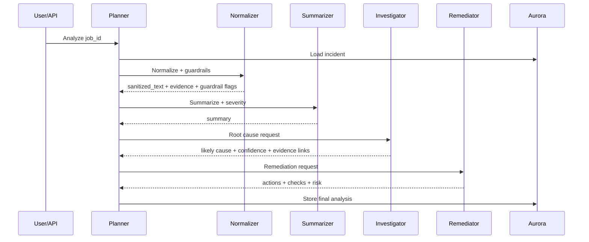

# Sentinel Agent Architecture

## Agent Roles
- **Planner**: orchestration and persistence lifecycle
- **Normalizer**: sanitization, prompt-injection filtering, evidence extraction
- **Summarizer**: concise summary + severity classification
- **Investigator**: likely root-cause analysis (Nova Pro)
- **Remediator**: prioritized next actions (Nova Pro)

## Sequence

## Guardrails
- Injection patterns are blocked before model analysis.
- Weak evidence forces low-confidence response.
- Remediation is constrained to observable/reversible steps.
