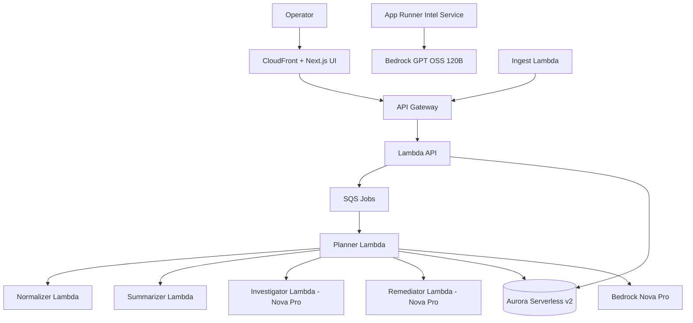

# Sentinel Architecture Overview

## Notes
- API writes incidents and jobs.
- Planner orchestrates all analysis steps.
- Normalizer enforces guardrails first.
- Aurora stores incidents, jobs, and analysis payloads.
- Intel service handles supporting analysis workflows.
